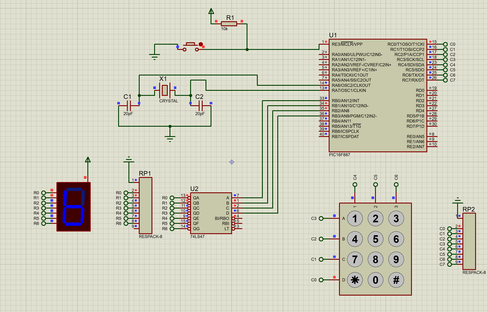

# 7-Segment Display Control with Keypad

## Description
This project demonstrates how to control a 7-segment display using a matrix keypad and a PIC microcontroller. The program allows users to input numbers and specific characters via the keypad, which are then displayed on the 7-segment display.

## Circuit
### Keypad and 7-Segment Display Setup
  
*Circuit setup for interfacing the keypad and 7-segment display with the microcontroller.*

## Code Explanation
The program scans the matrix keypad row by row to detect button presses. When a button is pressed, the corresponding BCD code is sent to the 7-segment display to show the appropriate number or character.

### Keypad Scanning Logic
- **Rows:** Connected to PORTC (RC0, RC1, RC2, RC3) as outputs.
- **Columns:** Connected to PORTC (RC4, RC5, RC6) as inputs.
- The microcontroller scans each row sequentially and checks for column inputs to determine which button is pressed.

### 7-Segment Display Control
- The 7-segment display is connected to PORTB.
- BCD codes are used to display numbers (0-9) and specific characters (E for '*', F for '#').

## Files
- `7_seg_&_keyboard.pdsprj`: Circuit schematic for the matrix keypad and 7-segment display.
- `7segment_keypad.c`: MikroC program for controlling the 7-segment display with the keypad.

## Instructions
1. Open `7segment_keypad.pdsprj` in Proteus to view the circuit design.
2. Compile `tp3_7_seg___keyboard.c` in MikroC to generate the hex file.
3. Upload the hex file to the microcontroller in Proteus.
4. Simulate the circuit and press the buttons on the keypad to observe the corresponding output on the 7-segment display.

## Tools
- MikroC Pro for PIC
- Proteus 8 Professional

## Troubleshooting
- Ensure all connections in the circuit are correct and secure.
- Verify that the BCD codes in the program match the 7-segment display configuration.
- Check for any syntax errors in the MikroC code.

